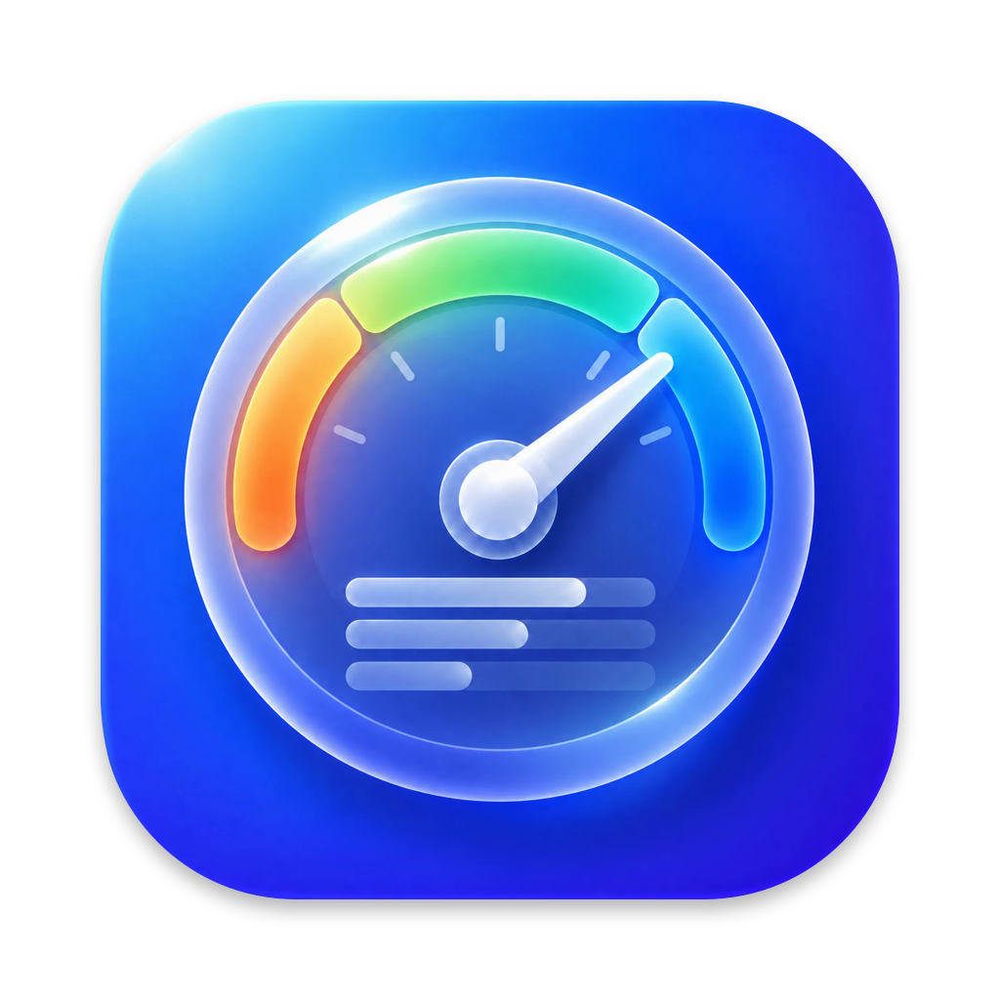
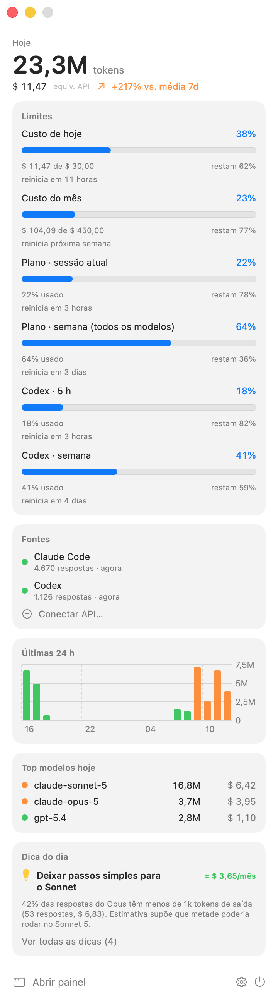
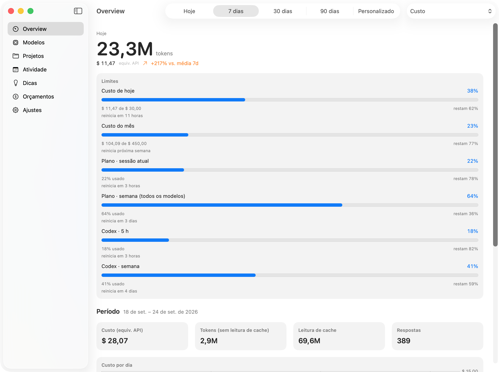
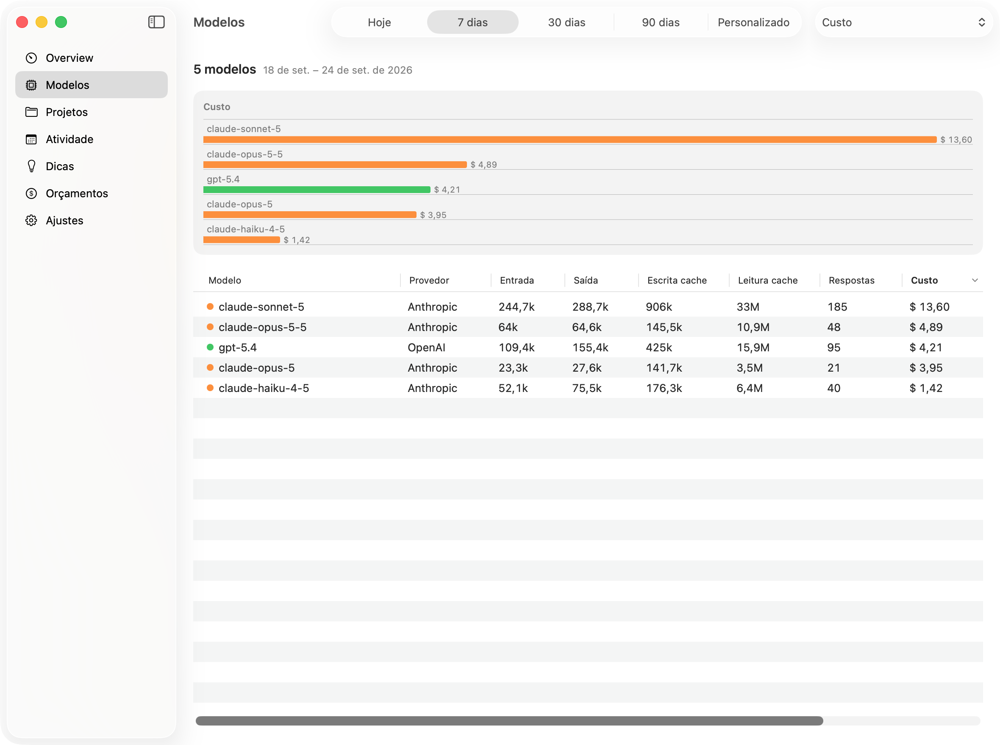
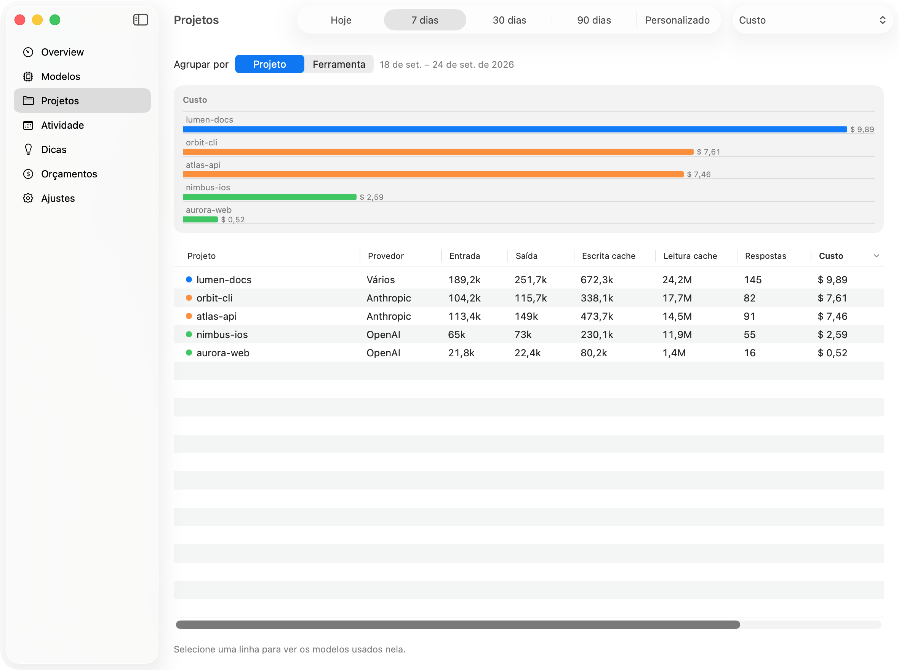
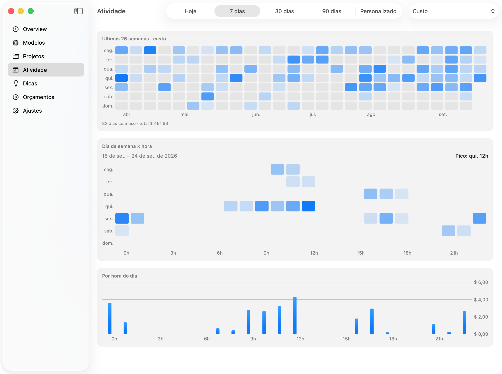
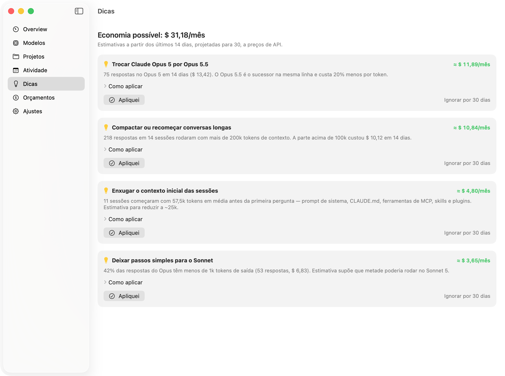
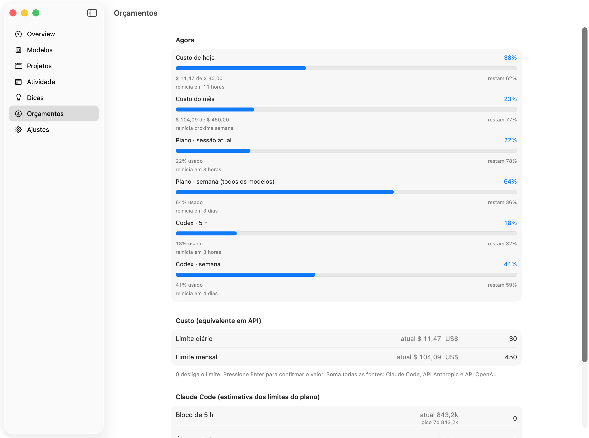
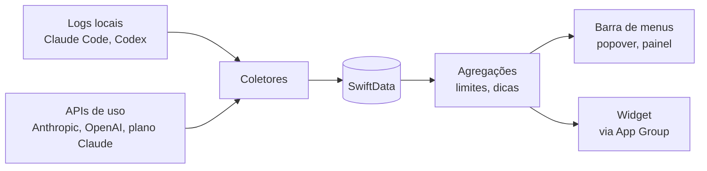

<p align="center">
  
</p>

<h1 align="center">TokenBar</h1>

<p align="center">
  Consumo de tokens de IA na barra de menus do macOS — quanto você usou, quanto resta dos seus limites e onde dá para economizar.
</p>

---

TokenBar é um app nativo (SwiftUI) que vive na barra de menus. Ele lê o uso do **Claude Code**, do **Codex** e, opcionalmente, das **APIs da Anthropic e da OpenAI**, e mostra tudo num só lugar — a um clique, sem abrir painéis de cada provedor. Fechar a janela não encerra o app: o ícone continua ativo.

## Capturas de tela

<p align="center">
  
  &nbsp;&nbsp;
  
</p>

<table>
  <tr>
    <td><p align="center"><b>Modelos</b></p></td>
    <td><p align="center"><b>Projetos</b></p></td>
  </tr>
  <tr>
    <td><p align="center"><b>Atividade</b></p></td>
    <td><p align="center"><b>Dicas</b></p></td>
  </tr>
  <tr>
    <td><p align="center"><b>Orçamentos</b></p></td>
    <td></td>
  </tr>
</table>

<sub>Dados fictícios, gerados pelo modo de demonstração.</sub>

## Funcionalidades

| Área | O que mostra |
| --- | --- |
| **Ícone na barra** | Tokens de hoje, custo de hoje, % da sessão do plano Claude (usado ou restante) ou % do limite mais próximo. Vira um aviso a partir de 80%. |
| **Popover** | Hoje (tokens, custo, variação vs. média de 7 dias), limites, fontes, últimas 24 h, top modelos e dica do dia. |
| **Overview** | Período escolhido (hoje, 7/30/90 dias ou personalizado): custo, tokens, cache, respostas, gráfico por dia/hora e ranking de modelos. |
| **Modelos** | Tabela ordenável por modelo: entrada, saída, cache, respostas, custo e participação. |
| **Projetos** | Consumo por projeto (raiz do repositório git) ou por ferramenta, com os modelos de cada um. |
| **Atividade** | Calendário de 26 semanas, mapa dia da semana × hora e horário de pico. |
| **Dicas** | Recomendações de economia com valor estimado por mês, passos para aplicar e **economia realizada** depois de aplicadas. |
| **Orçamentos** | Limites de custo diário/mensal, estimativa dos limites do Claude Code e alertas nativos em 50/80/95%. |
| **Widget** | Anel com o que resta da sessão do plano, outros limites e o consumo de hoje (pequeno e médio). |

### Fontes de dados

| Fonte | Como é lida | Configuração |
| --- | --- | --- |
| Claude Code | Logs locais em `~/.claude/projects`, em tempo real | Automática |
| Codex | Logs locais em `~/.codex/sessions`, incluindo os limites do plano (5 h e semana) | Automática |
| Plano Claude (Pro/Max) | Sessão atual e limites semanais — os mesmos números de *Settings → Usage* | Opcional, em Ajustes |
| API Anthropic | Admin API (`usage_report/messages`) | Chave de admin, opcional |
| API OpenAI | Usage API + Costs API da organização | Chave de admin, opcional |

## Privacidade

- Tudo roda e fica na sua máquina: banco SwiftData em `~/Library/Application Support/TokenBar`.
- Chaves de API ficam no **Keychain** e só são usadas para ler relatórios de uso.
- A leitura do plano Claude usa o login que o Claude Code já guarda no Keychain; o token só é lido (nunca renovado) e só é enviado para `api.anthropic.com`.
- Nenhum conteúdo de conversa é lido ou armazenado — só contagens de tokens, modelo, horário, projeto e ferramenta.

## Requisitos

- macOS 15 ou superior (visual pensado para o macOS 26)
- Xcode 26
- Um certificado **Apple Development** (necessário para o App Group compartilhado com o widget)

## Compilar e instalar

1. Clone o repositório e abra `TokenBar.xcodeproj`.
2. Ajuste a assinatura para o **seu** time (o projeto vem configurado com o time do autor):
   - Em *Signing & Capabilities* dos targets **TokenBar** e **TokenBarWidget**, escolha seu time.
   - Troque o App Group `NF5D39SHC8.dev.galuppo.TokenBar` pelo seu Team ID em `Entitlements/*.entitlements` e em `Shared/WidgetSnapshot.swift`.
3. Para desenvolver, rode o esquema **TokenBar** (⌘R).
4. Para instalar em `/Applications`:

```bash
scripts/install.sh
```

O script compila em Release, substitui `/Applications/TokenBar.app` e abre o app. Rode de novo sempre que atualizar o código.

### Modo de demonstração

Builds de desenvolvimento têm um modo com dados fictícios, usado para as capturas acima. Ele usa um banco separado (`~/Library/Application Support/TokenBar-Demo`), não lê logs nem APIs e não altera o widget nem as preferências:

```bash
open -n build/DerivedData/Build/Products/Debug/TokenBar.app --args -demo YES \
  -budget.dailyUSD 30 -budget.monthlyUSD 450 -planUsage.enabled YES
```

O painel e uma prévia do popover abrem como janelas.

## Primeiros passos

1. Clique no ícone de medidor na barra de menus.
2. Em **Ajustes**:
   - ligue **Abrir ao iniciar sessão**;
   - ative **Plano Claude** para ver a sessão atual — o macOS vai pedir acesso ao item *Claude Code-credentials*; escolha **Sempre permitir**;
   - escolha o que mostrar na barra de menus.
3. Em **Orçamentos**, defina limites e ligue os alertas.
4. Adicione o widget: clique com o botão direito na mesa → **Editar widgets** → **TokenBar**.

## Custos e preços

Os custos são **equivalentes a preços de API**. Em planos de assinatura (Pro/Max, ChatGPT Plus) esse valor não é cobrado — serve para comparar e priorizar.

A tabela fica em [`TokenBar/Resources/prices.json`](TokenBar/Resources/prices.json) (preços da API Anthropic por milhão de tokens, com escrita de cache a 1,25× / 2× e leitura de cache). Para personalizar, salve um `prices.json` no mesmo formato em `~/Library/Application Support/TokenBar/` e use **Reimportar histórico** em Ajustes. Modelos sem preço (como os do Codex) aparecem com custo US$ 0.

## Como funciona



- Os logs são lidos de forma **incremental**: o app guarda até onde leu em cada arquivo e reage a mudanças via FSEvents.
- Cada resposta tem um identificador estável na origem, então reler um log nunca conta em dobro.
- As dicas medem o desperdício **por unidade de uso** (antes × depois de aplicar), para separar o efeito da dica de variações no volume de trabalho.

## Estrutura do projeto

| Pasta | Conteúdo |
| --- | --- |
| `TokenBar/App` | Ciclo de vida, `MenuBarExtra`, janela principal |
| `TokenBar/Collectors` | Coletor JSONL, parsers Claude Code e Codex, conectores de API, plano Claude, FSEvents |
| `TokenBar/Model` | `UsageEvent`, provedores, tabela de preços, banco |
| `TokenBar/Services` | Agregações, limites, alertas, dicas, Keychain, publicação do widget |
| `TokenBar/UI` | Popover, painel e telas |
| `Shared` | Código usado pelo app e pelo widget |
| `TokenBarWidget` | Extensão do widget |
| `scripts` | `install.sh` e `set-icon.swift` (aplica uma arte ao AppIcon) |

## Limitações conhecidas

- O endpoint do plano Claude é o mesmo que o `/usage` do Claude Code consulta; não é documentado e pode mudar sem aviso.
- Os limites de Pro/Max estimados a partir dos logs são aproximações; a leitura do plano traz os números reais.
- A Admin API da Anthropic não existe para contas individuais, só para organizações.
- Se o Claude Code usa uma chave de API da mesma organização, conectar também a API Anthropic conta esse consumo em dobro — use só uma das fontes.

## Roadmap

- [ ] OpenRouter, Gemini e modelos locais (Ollama)
- [ ] Distribuição com atualização automática (Sparkle) e notarização

## Licença

Distribuído sob a licença MIT. Veja [LICENSE](LICENSE).
